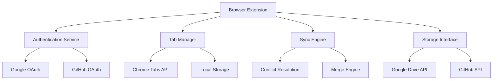

# Design Document

## Overview

The Tab Sync Extension is a Chromium browser extension that enables secure, manual synchronization of browser tabs across multiple devices using OAuth authentication with Google or GitHub. The extension follows a client-server architecture where each browser instance acts as a client, and cloud storage (Google Drive or GitHub) serves as the centralized data store.

## Architecture

### High-Level Architecture



### Extension Structure

The extension will use Manifest V3 and consist of:

- **Background Service Worker**: Handles authentication, sync operations, and keyboard shortcuts
- **Popup Interface**: Quick access to sync controls and status
- **Options Page**: Comprehensive settings and sync history
- **Content Scripts**: Not required for this extension

## Components and Interfaces

### 1. Authentication Service

**Purpose**: Manages OAuth flows and token storage

**Key Methods**:
- `authenticateWithGoogle()`: Initiates Google OAuth flow
- `authenticateWithGitHub()`: Initiates GitHub OAuth flow  
- `getStoredTokens()`: Retrieves cached authentication tokens
- `refreshTokens()`: Handles token refresh logic
- `signOut()`: Clears authentication data

**Storage**: Uses Chrome's secure storage API for tokens

### 2. Tab Manager

**Purpose**: Interfaces with Chrome's tabs API and manages tab data

**Key Methods**:
- `getCurrentTabs()`: Retrieves all open tabs with metadata
- `applyTabChanges(changes)`: Opens/closes tabs based on sync data
- `serializeTabData()`: Converts tabs to sync-friendly format
- `deserializeTabData()`: Converts sync data back to tab objects

**Data Structure**:
```typescript
interface TabData {
  id: string;
  url: string;
  title: string;
  favicon?: string;
  windowId: number;
  index: number;
  timestamp: number;
  deviceId: string;
}
```

### 3. Sync Engine

**Purpose**: Orchestrates synchronization operations and conflict resolution

**Key Methods**:
- `triggerSync()`: Main sync entry point
- `detectConflicts(local, remote)`: Identifies conflicting tab states
- `mergeTabSets(local, remote, userChoices)`: Combines tab data
- `uploadSyncData(data)`: Sends data to cloud storage
- `downloadSyncData()`: Retrieves data from cloud storage

**Conflict Definition**:
Conflicts occur when:
- **Timestamp Conflicts**: Local device and remote data both have changes newer than the last successful sync timestamp
- **Tab Conflicts**: Same URL exists in both local and remote with different metadata (title, position, window)
- **Structural Conflicts**: Different tab organization (window grouping, tab order) between devices

**Sync Algorithm**:
1. Fetch current local tabs
2. Download remote sync data  
3. Compare last sync timestamps to detect potential conflicts
4. If timestamps indicate concurrent changes, perform detailed tab comparison
5. If conflicts exist, present merge UI with conflict details
6. Apply merged changes locally and remotely
7. Update sync history with conflict resolution details

### 4. Storage Interface

**Purpose**: Abstracts cloud storage operations

**Implementations**:
- `GoogleDriveStorage`: Uses Google Drive API for data persistence
- `GitHubStorage`: Uses GitHub API (private repository or gists)

**Key Methods**:
- `store(data)`: Saves sync data to cloud
- `retrieve()`: Fetches latest sync data
- `getHistory()`: Returns sync operation history

### 5. UI Components

#### Popup Interface
- Sync status indicator
- Manual sync trigger button
- Quick settings access
- Authentication status

#### Options Page
- Detailed sync history table
- Keyboard shortcut configuration
- Account management (sign in/out)
- Sync preferences and filters

## Data Models

### Sync Data Structure

```typescript
interface SyncData {
  version: string;
  deviceId: string;
  timestamp: number;
  tabs: TabData[];
  metadata: {
    deviceName: string;
    browserVersion: string;
    extensionVersion: string;
  };
}
```

### Conflict Resolution Data

```typescript
interface ConflictData {
  localTabs: TabData[];
  remoteTabs: TabData[];
  conflicts: {
    type: 'duplicate' | 'modified' | 'deleted';
    localTab?: TabData;
    remoteTab?: TabData;
  }[];
}
```

### Storage Schema

Cloud storage will contain:
- `sync-data.json`: Latest tab synchronization data
- `sync-history.json`: Historical sync operations
- `device-registry.json`: List of registered devices

## Error Handling

### Authentication Errors
- OAuth failures: Retry mechanism with exponential backoff
- Token expiration: Automatic refresh with fallback to re-authentication
- Network errors: Queue operations for retry when connection restored

### Sync Errors
- Cloud storage failures: Local caching with retry queue
- Data corruption: Validation and recovery from backup
- Merge conflicts: User-guided resolution with safe defaults

### Recovery Mechanisms
- Local backup of last known good state
- Rollback capability for failed sync operations
- Data validation before applying changes

## Testing Strategy

### Unit Tests
- Authentication service token handling
- Tab serialization/deserialization
- Conflict detection algorithms
- Storage interface implementations

### Integration Tests
- End-to-end sync workflows
- OAuth flow completion
- Cloud storage operations
- UI component interactions

### Manual Testing
- Cross-device sync scenarios
- Conflict resolution workflows
- Keyboard shortcut functionality
- Extension installation/upgrade paths

### Test Data
- Mock tab datasets for various scenarios
- Simulated conflict situations
- Network failure conditions
- Authentication edge cases

## Security Considerations

### Data Protection
- Encrypt sensitive tab data before cloud storage
- Use secure token storage (Chrome's secure storage)
- Implement proper OAuth scopes (minimal required permissions)

### Privacy
- No automatic data collection
- User consent for all sync operations
- Clear data deletion on sign-out
- Transparent data usage policies

### Access Control
- Device-specific authentication tokens
- Secure API communication (HTTPS only)
- Token rotation and expiration handling